[](https://www.microchip.com)

# CAN 2.0 Setup For the PIC18-Q83 Family of Microcontrollers

This project showcases the setup and use of the new CAN 2.0 (Controller Area Network) module on the PIC18-Q83 family of devices using MPLAB® Code Configurator (MCC) Melody. This software speeds up the configuration time and hassle for settings such as baud rate, receive masks/filters and handling receive/transmit FIFO buffers.

This example's functionality includes periodically transmitting CAN frames on 1s intervals, echoing incoming messages with a specific message ID (0x111), and setting LEDs based on data with a different specific message ID (0x585).  

## Related Documentation

Configuring the PIC18 CAN 2.0 Module found in [TB3266 - Basic Configuration of the PIC18 CAN FD Module](https://ww1.microchip.com/downloads/aemDocuments/documents/MCU08/ProductDocuments/ProductBrief/90003266A.pdf) with a few exceptions specific to CAN 2.0.

1. Only CAN 2.0 normal mode is used (REQOP=0b110)
2. CAN 2.0 only uses the Nominal Bit Rate setup steps for the timing on the entire CAN Frame
3. CAN 2.0 can only have DLC of 8 bytes or fewer
4. Any bits in the CAN frame specific to FD functionality (BRS,FDF) are not used

## Software Used
- [MPLAB X IDE 6.10](https://www.microchip.com/en-us/tools-resources/develop/mplab-x-ide?utm_source=GitHub&utm_medium=TextLink&utm_campaign=MCU8_MMTCha_pic18q83&utm_content=pic18f47q83-can-2.0-basic-operation-mplab-mcc&utm_bu=MCU08) or newer 
- [MPLAB XC8 2.41.0](https://www.microchip.com/en-us/tools-resources/develop/mplab-xc-compilers?utm_source=GitHub&utm_medium=TextLink&utm_campaign=MCU8_MMTCha_pic18q83&utm_content=pic18f47q83-can-2.0-basic-operation-mplab-mcc&utm_bu=MCU08) or newer compiler
- [MPLAB Code Configurator Melody 5.5.7](https://www.microchip.com/en-us/tools-resources/configure/mplab-code-configurator?utm_source=GitHub&utm_medium=TextLink&utm_campaign=MCU8_MMTCha_pic18q83&utm_content=pic18f47q84-can-2.0-basic-operation-mplab-mcc&utm_bu=MCU08) or newer

## Hardware Used

  - [PIC18F47Q83 DIP](https://www.microchip.com/en-us/product/PIC18F57Q83?utm_source=GitHub&utm_medium=TextLink&utm_campaign=MCU8_MMTCha_pic18q83&utm_content=pic18f47q83-can-2.0-basic-operation-mplab-mcc&utm_bu=MCU08)
  - [Curiosity High Pin Count (HPC) Development Board](https://www.microchip.com/en-us/development-tool/DM164136?utm_source=GitHub&utm_medium=TextLink&utm_campaign=MCU8_MMTCha_pic18q83&utm_content=pic18f47q83-can-2.0-basic-operation-mplab-mcc&utm_bu=MCU08)
  - [ATA6563 Click board](https://www.mikroe.com/ata6563-click)
  - [K2L OptoLyzer® MOCCA FD](https://www.microchip.com/en-us/tools-resources/develop/k2l-automotive-tools?utm_source=GitHub&utm_medium=TextLink&utm_campaign=MCU8_MMTCha_pic18q83&utm_content=pic18f47q83-can-2.0-basic-operation-mplab-mcc&utm_bu=MCU08)

## Setup

The hardware consists of a [PIC18F47Q83 DIP](https://www.microchip.com/en-us/product/PIC18F57Q83?utm_source=GitHub&utm_medium=TextLink&utm_campaign=MCU8_MMTCha_pic18q83&utm_content=pic18f47q83-can-2.0-basic-operation-mplab-mcc&utm_bu=MCU08) in a [Curiosity HPC Development Board](https://www.microchip.com/en-us/development-tool/DM164136?utm_source=GitHub&utm_medium=TextLink&utm_campaign=MCU8_MMTCha_pic18q83&utm_content=pic18f47q83-can-2.0-basic-operation-mplab-mcc&utm_bu=MCU08), which breaks out the microcontroller's pins as well as serves as the programmer/debugger. It also serves as a backplane for connecting the Q83's CAN TX/RX pins to the ATA6563. From there, the ATA6563 converts the incoming TX/RX into the differential pair required for CAN communication. In the setup picture below, the jumper wires are used to bridge the TX/RX pins on the Q83 to pins that can be access by the ATA6563 on it's mikroBUS connector.

For this setup, the K2L MOCCA FD was used as a CAN bus analyzer to both view the outgoing CAN frames and to send the incoming ones to the device.

#### Hardware Setup
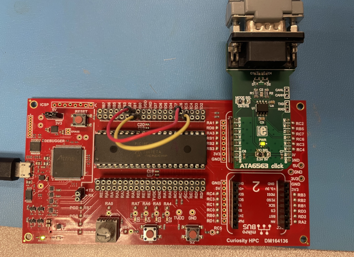


### MCC Walkthrough
This section is for first time MCC users. To start, create a new standalone project in MPLAB X with the PIC18F47Q83 as the selected microcontroller. After being greeted by the text editor, select the **MCC** button. If you haven't installed MCC yet, follow [this guide first](https://onlinedocs.microchip.com/pr/GUID-1F7007B8-9A46-4D03-AEED-650357BA760D-en-US-6/index.html?GUID-D98198EA-93B9-45D2-9D96-C97DBCA55267).

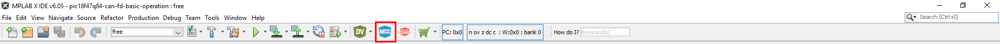

From there, click "Select MCC Melody" and finish. You will be met with the application builder (highlighted in red). To configure a module, double click it from the Devices Resources (green) and it will:
1. Move into Project Resources.
2. Show up in the builder.
3. Pull up its configuration window on the right where the parameters can be changed.

 When ready, click the **Generate** button (yellow) to generate the application code.

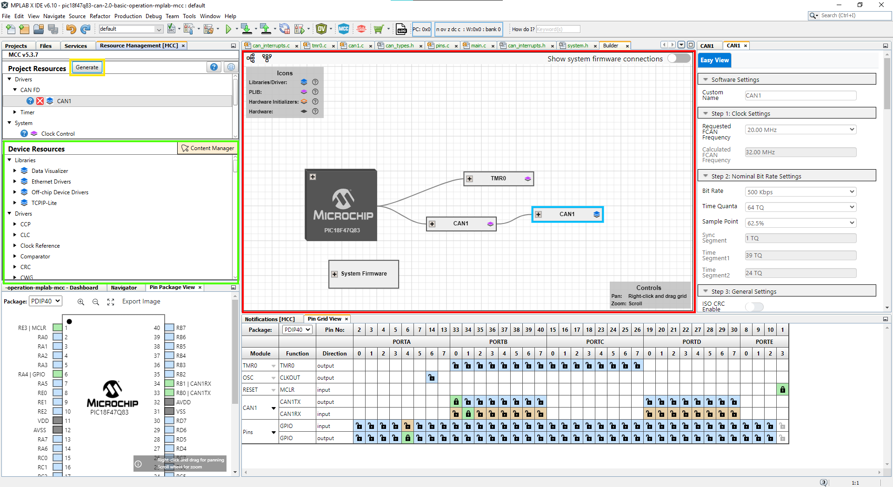

### Project Configuration
Before configuring CAN, the microcontroller's clock settings needs changed. Configure the "Clock Control" module to use the internal high frequency oscillator (HFINTOSC) with a frequency of 32 MHz. Normal CAN operating frequency includes 10, 20, or 40 MHz. 32 MHz was chosen since it is close to 40 MHz.

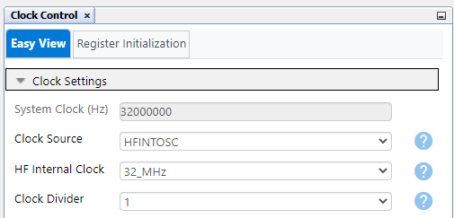


## CAN 2.0 Configuration

To configure CAN 2.0, add the CAN 2.0 module from the Device Resources section. The setup has five sections, the first being the clock setup. For this, configure the CAN1 PLIB to use FOSC, then move to the CAN1 driver configuration window.


From the driver configuration window, set the FCAN frequency and bit rate settings. For this example, a 500 Kbps nominal rate was selected with 64 time quantas per bit and a 50% sample point. Since 32 MHz is a non-standard CAN speed, make sure your CAN bus analyzer supports the set sample point. By raising the TQ to the maximum supported, it increases the precision of the communication timings between the analyzer.

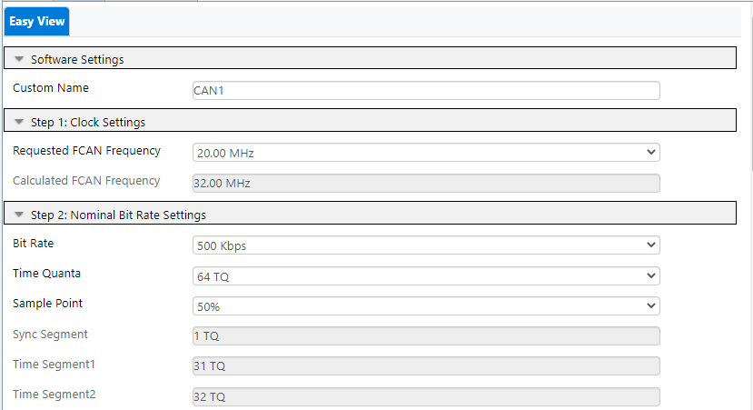

The third step is general settings. This only has two options: Enable ISO CRC and Enable Error Interrupt. ISO CRC is disabled since CAN 2.0 does not support ISO CRC. The Error Interrupt is for potential issues on messages/buses, and is not used in this demonstration.

The fourth step is the FIFO settings. Here is where the transmit and receive FIFOs are set up. It allows for setting up depth, payload size and TX/RX selection for each FIFO, while showing how much of the FIFO space is being consumed by the currently selected FIFOs. In addition, this allows for selecting specific interrupt triggers for each FIFO which will generate the function prototypes/pointers for these interrupts in the code. In this example, the TXQ is used as the transmit FIFO, with FIFO1 and FIFO2 being set as receive. All three are set to a depth of six and a payload of 32 bytes, with both receive FIFOs set to interrupt on not-empty.

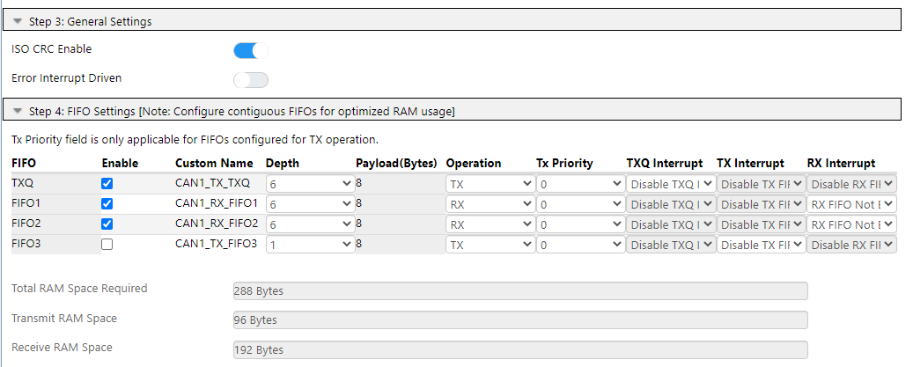

The fifth and final step is the Filter Object settings. This allows for setup of masks and filters, which determine which message IDs are accepted. Each filter object can be associated with a specific receive FIFO and any number of message IDs can be entered, which will automatically set up the masks/filters to accept those IDs. FIFO1 will respond to messages with an ID of 0x111 and FIFO2 will respond to messages with an ID of 0x585. We will setup their responses later in code.

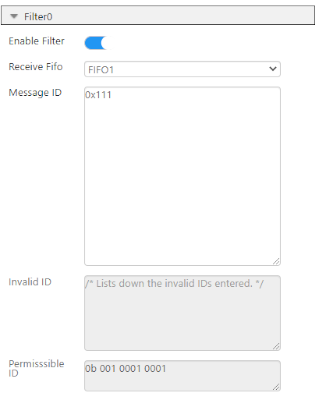
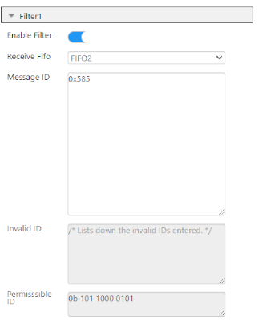

#### Timer0 (TMR0) Configuration
After setting up CAN, a 1s timer is needed to periodically transmit CAN frames. Use the TMR0 module to generate an interrupt every 1s. Add the TMR0 module from Device Resources and configure it as follows. Similar to the CAN FIFO interrupts, we will have to manually code the interrupt behavior later.

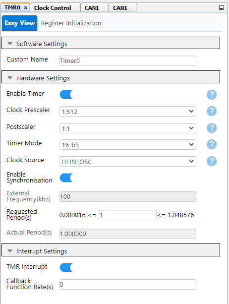

#### Pin Configuration
After configuring the modules, use the **Pin Grid View** tab to configure the pins as inputs and outputs. For CAN, any I/O pins on PORTB or PORTD can be either CANTX or CANRX. However, connecting the ATA6563 click to the mikroBUS slot puts the click's TX pin on RC7 and the RX pin on RC6. Since this mapping can't be achieved with the Q83's PPS, we need to run jumpers across the board to connect pins RC6 and RC7 to any pins on PORTB or PORTD. For this example, pin RB0 was set as CANTX, and RB1 as CANRX. Then, RB0 (CANTX) was jumpered to RC6 (RX for the transceiver) and RB1 (CANRX) was jumpered to RC7 (TX for the transceiver) as seen in the picture below. Also, set RA4 as an output to drive the LEDs connected on the HPC board.

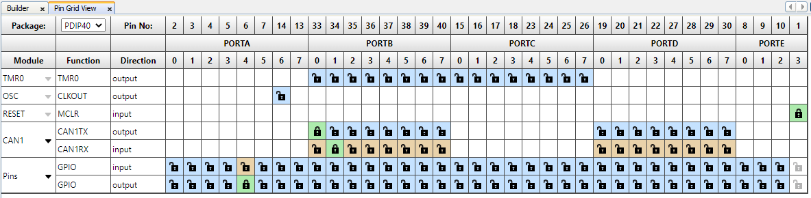

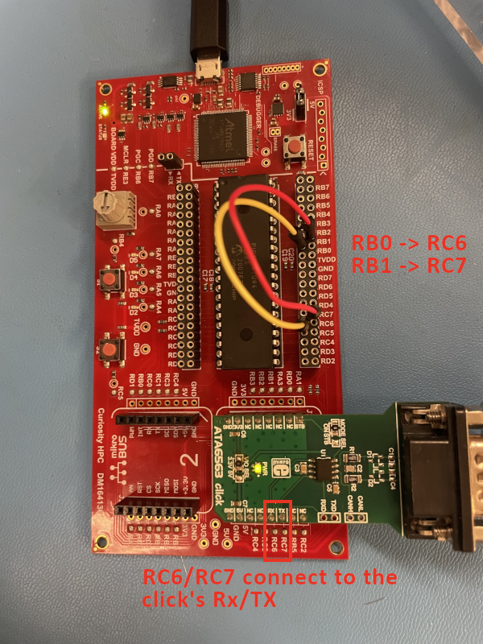

The last step is to click the **Generate** button to generate the application code. MCC can now be closed.

### Interrupt Code
After using MCC, we have a fully functional API to handle our CAN communication as well as a timer generating an interrupt every 1s. Three functions need to be implemented manually: one for each of the two FIFO interrupts, since they generate an interrupt when they become not empty, and one for the TMR0 1s interrupt.

To do this, create a file named `can_interrupts.c`, then add the content below.

Since the needed code references the API's CAN objects and PIN definitions for easy access, including `system.h` includes all relevant MCC generated headers
```c
#include "mcc_generated_files/system/system.h"
```
The first FIFO responds to any message that has a message ID of 0x111 by echoing the content back but with a different message ID, 0x222.
```c
void CAN1_FIFO1CustomHandler(void)
{
    struct CAN_MSG_OBJ EchoMessage;  //create a message object for holding the data
    while(1)
    {
        if(CAN1_ReceivedMessageCountGet() > 0) //check for received message
        {
            if(CAN1_Receive(&EchoMessage)) //receive the message
            {
                break;
            }
        }
    }
    EchoMessage.msgId=0x222; //Change the ID to 0x222 then echo the message back out
    if(CAN_TX_FIFO_AVAILABLE == (CAN1_TransmitFIFOStatusGet(CAN1_TXQ) & CAN_TX_FIFO_AVAILABLE))
    {
        CAN1_Transmit(CAN1_TXQ, &EchoMessage); //Send the message
    }
}
```
The second FIFO toggles the LED on the RF3 pin based on the least significant bit in the message with a message ID of 0x585.
```c
void CAN1_FIFO2CustomHandler(void)
{
    struct CAN_MSG_OBJ InternalMessage; //create a message object for holding data
    while(1)
    {
        if(CAN1_ReceivedMessageCountGet() > 0) //check for received message
        {
            if(CAN1_Receive(&InternalMessage)) //receive the message
            {
                break;
            }
        }
    }
    IO_RA4_LAT = ~(InternalMessage.data[0] & 0b1); // set if first bit of first byte is 1 or 0
}
```
Timer0 interrupts every 1s. This interrupt handler sends a message with the content 0x0011223344556677 and a message ID of 0x100.
```c
void Timer0_CustomHandler(void){
    struct CAN_MSG_OBJ Transmission;  //create the CAN message object
    uint8_t Transmit_Data[8]={0x00,0x11,0x22,0x33,0x44,0x55,0x66,0x77}; // data bytes
    Transmission.field.brs=CAN_NON_BRS_MODE; // No bit rate switching
    Transmission.field.dlc=DLC_8; //8 data bytes
    Transmission.field.formatType=CAN_2_0_FORMAT; //CAN 2.0 frames 
    Transmission.field.frameType=CAN_FRAME_DATA; //Data frame
    Transmission.field.idType=CAN_FRAME_STD; //Standard ID
    Transmission.msgId=0x100; //ID of 0x100
    Transmission.data=Transmit_Data; //transmit the data from the data bytes
    if(CAN_TX_FIFO_AVAILABLE == (CAN1_TransmitFIFOStatusGet(CAN1_TXQ) & CAN_TX_FIFO_AVAILABLE))//ensure that the TXQ has space for a message
    {
        CAN1_Transmit(CAN1_TXQ, &Transmission); //transmit frame
    }  
}
```
Create a header file for these functions `can_interrupts.h` and include the function prototypes so they can be accessed outside the `can_interrupts.c` file.
```c
void CAN1_FIFO1CustomHandler(void);
void CAN1_FIFO2CustomHandler(void);
void Timer0_CustomHandler(void);
```

Finally, add a couple of lines to the main function in `main.c`. First, `SYSTEM_Initialize()` runs the MCC generated code that sets all the necessary registers and Configuration bits for configuring the clock, pins, CAN, timers, etc. Next, after interrupts are enabled, access the MCC generated functions that assign the function pointers for each of the relevant interrupt callbacks so they can access the custom functions.
```c
#include "mcc_generated_files/system/system.h"
#include "can_interrupts.h"

int main(void)
{
    SYSTEM_Initialize();

    // Enable the Global High Interrupts 
    INTERRUPT_GlobalInterruptHighEnable(); 

    // Enable the Global Low Interrupts 
    INTERRUPT_GlobalInterruptLowEnable(); 

    Timer0_OverflowCallbackRegister(Timer0_CustomHandler);
    
    CAN1_FIFO1NotEmptyCallbackRegister(CAN1_FIFO1CustomHandler);
    CAN1_FIFO2NotEmptyCallbackRegister(CAN1_FIFO2CustomHandler);
    
    while(1)
    {
    }    
}
```
The configuration of the project is now done. Click **Make and Program Device** and the Q83 is ready to send and receive CAN messages. [This guide](https://mplab-discover.microchip.com/com.microchip.mcu8.mplabx.project.pic18f56q71-cnano-adccc-differential-reading-mplab-mcc) shows how to make and program a device for the first time if needed.

## Operation

On power-up, the code will periodically transmit messages with an ID of 0x100 and 8 bytes of data (data = 0x0011223344556677) every 1s.

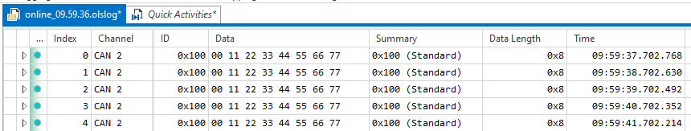

Sending the Q83 a message with an ID of 0x111 will cause the device to respond with an echo frame with an ID of 0x222 and identical data frames.

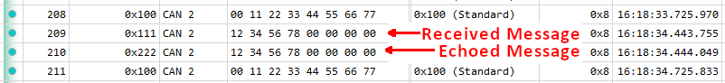

Sending a message with an ID of 0x585 will set the on-board LED to change to the value of the first bit (`1` = on, `0` = off).

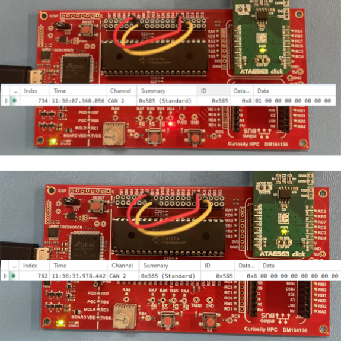

## Summary

This demo gives a basic example of using MCC to perform CAN 2.0 bit rate setup, message transmission and message reception with both filtering and interrupt-driven responses.
